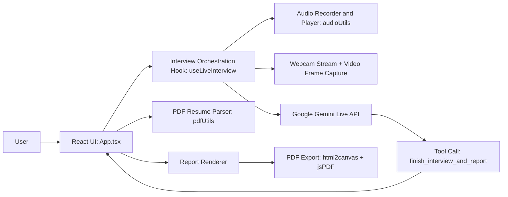
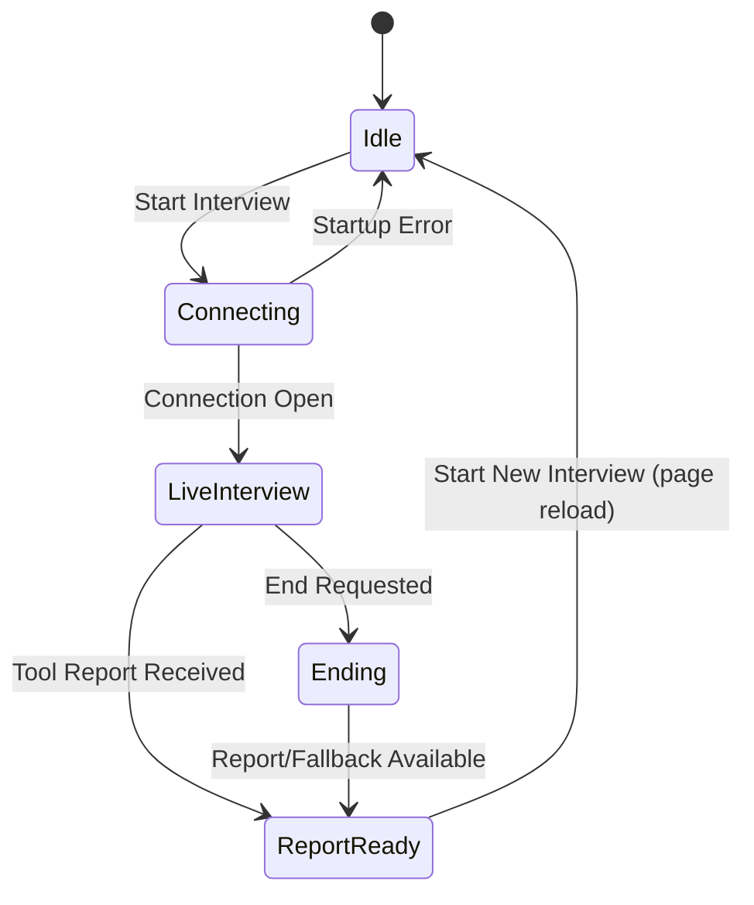

# AI Mock Interviewer - Detailed Architecture Report

## 1. Project Overview

AI Mock Interviewer is a browser-based, real-time interview simulator built with React + TypeScript + Vite.
It combines:

- Candidate context ingestion (Job Description + Resume text/PDF)
- Live multimodal interview session (audio + periodic video frames)
- AI-driven questioning and assessment
- Final interview report generation and PDF export

The project runs fully on the client side, with the Gemini Live API handling interview intelligence and report generation.

## 2. Primary Product Goals

- Simulate a realistic technical/behavioral interview in real time.
- Personalize questions using candidate resume and target job description.
- Evaluate not only answers, but also visible confidence/body-language cues.
- Generate a structured post-interview feedback report.
- Let users export the report as a downloadable PDF.

## 3. High-Level Architecture

## 4. Runtime Lifecycle

### 4.1 Input Phase

1. User enters job description text.
2. User uploads resume file:
   - PDF -> text extraction via `pdfjs-dist`
   - TXT -> plain text read
3. UI validates both inputs before allowing interview start.

### 4.2 Session Startup Phase

1. `startInterview(resumeText, jobDescription)` is called.
2. Hook initializes:
   - Gemini client
   - Audio recorder (mic + camera permissions)
   - Audio player for AI voice output
3. Hook connects to Gemini Live model with:
   - System instruction containing resume + job description
   - Function tool schema for final report (`finish_interview_and_report`)
   - Audio response modality + selected voice

### 4.3 Live Interview Phase

1. Recorder captures mic audio (16k PCM) and streams chunks to Gemini.
2. Webcam stream is attached to local preview video element.
3. Every ~2 seconds, a JPEG frame is captured and sent for visual signal analysis.
4. Gemini returns streamed audio; player schedules PCM playback (24k).
5. UI shows connection state, speaking animation, and interview timer.

### 4.4 Interview End + Report Phase

1. User ends interview or AI decides interview is complete.
2. Hook requests model to call `finish_interview_and_report`.
3. Model returns structured feedback fields:
   - overall_feedback
   - strengths[]
   - areas_for_improvement[]
   - emotion_and_body_language
   - score
4. Hook stores report and transitions UI to report view.
5. User may export report UI to PDF.

### 4.5 Cleanup Phase

On close/error/end, hook reliably clears:

- Recording processor/source
- Active media tracks
- Audio playback queue
- Video frame interval
- End timeout fallback
- Live session handle

## 5. Source Structure and Responsibilities

### Root

- `index.html`: Vite mount point.
- `vite.config.ts`: React + Tailwind plugins, env injection, aliasing.
- `tsconfig.json`: TypeScript configuration.
- `package.json`: scripts and dependencies.
- `README.md`: setup and project-level documentation.

### Application Source (`src/`)

- `main.tsx`
  - App bootstrap and React root render.

- `App.tsx`
  - Main UI and interaction controller.
  - Handles:
    - Job description input
    - Resume upload/extraction trigger
    - Interview start/end controls
    - Live session screen rendering
    - Final report rendering + PDF export

- `hooks/useLiveInterview.ts`
  - Core session orchestration layer.
  - Encapsulates:
    - Gemini Live connection setup
    - Recorder/player lifecycle
    - Stream/message callbacks
    - Tool call handling for report generation
    - Error/fallback behaviors

- `lib/audioUtils.ts`
  - Audio transport utilities.
  - `AudioRecorder`:
    - captures mic input
    - converts Float32 -> PCM16 -> Base64
  - `AudioPlayer`:
    - decodes Base64 PCM16
    - schedules smooth AudioContext playback

- `lib/pdfUtils.ts`
  - PDF parsing utility.
  - Configures PDF.js worker and extracts text page by page.

- `lib/utils.ts`
  - Styling helper (`cn`) combining `clsx` + `tailwind-merge`.

- `index.css`
  - Tailwind import, typography setup, and custom animation styles.

## 6. State Model

The application behaves like a finite-state UI controlled by `report`, `isConnecting`, `isConnected`, and `error`.

## 7. Data and Control Flows

### 7.1 Resume Data Flow

1. File input receives PDF/TXT.
2. Parser extracts plain text.
3. Resume text is passed into interview system instruction.

### 7.2 Audio Flow

1. Browser mic stream -> `AudioRecorder`.
2. Recorder emits Base64 PCM16 chunks.
3. Hook forwards chunks to Gemini Live session.
4. AI audio chunks returned -> `AudioPlayer`.
5. Player schedules output to speakers.

### 7.3 Video/Body-Language Flow

1. Webcam stream is displayed locally.
2. Snapshot frames captured on fixed interval.
3. Frames sent to Gemini as JPEG inline data.
4. Final report includes emotion/body-language summary.

## 8. AI Integration Design

### 8.1 Prompting Strategy

The system instruction combines:

- Role definition (expert interviewer)
- Candidate context (resume + JD)
- Interview process rules (drive interview, ask follow-up questions)
- End condition rules (5-6 questions or user request)
- Mandatory tool usage for final report

### 8.2 Tool-Based Structured Output

Instead of free-form text parsing, the app uses function calling to enforce schema and improve reliability.

Benefits:

- Predictable report payload
- Simple UI binding
- Cleaner fallback behavior when partial/missing fields exist

### 8.3 Fallback Strategy

If report generation is delayed or fails, a fallback report is produced after timeout to preserve user flow.

## 9. Error Handling and Resilience

Current resilience mechanisms:

- Input validation before start.
- Try/catch wrappers around startup/end operations.
- Graceful tool-call argument fallback.
- Timeout-based fallback report on delayed termination.
- Defensive cleanup in both `onerror` and `onclose` callbacks.

Potential edge cases to monitor:

- Device permission denial (mic/camera).
- Browser AudioContext restrictions.
- Network instability during live stream.
- Oversized or malformed resume files.

## 10. Security and Privacy Considerations

- API key is injected via Vite environment variable (`GEMINI_API_KEY`).
- Resume and interview content are transmitted to Gemini service for processing.
- No custom backend persistence layer exists in this repository.
- Media streams are local and explicitly stopped during cleanup.

Recommended hardening:

- Move API access behind a server-side proxy for production.
- Add explicit data-retention statement in product docs.
- Add file size/type guardrails and user-facing privacy notice.

## 11. Performance Characteristics

- Lightweight client architecture with no custom backend server required.
- Snapshot interval (2 seconds) balances visual analysis fidelity and bandwidth usage.
- Audio playback queue scheduling reduces glitches between chunks.
- PDF export renders current report DOM; export time scales with report complexity.

## 12. Build and Tooling Architecture

- Bundler: Vite
- Framework: React 19 + TypeScript
- Styling: Tailwind CSS v4
- Icons: lucide-react
- Media/PDF libs: pdfjs-dist, html2canvas, jsPDF

Key scripts:

- `npm run dev`: local development server
- `npm run build`: production build
- `npm run preview`: local preview of production build
- `npm run lint`: type-check (`tsc --noEmit`)

## 13. Extension Opportunities

High-impact future improvements:

- Replace page reload reset with state-driven restart.
- Add interview transcript timeline.
- Add rubric-based scoring dimensions (communication, technical depth, confidence).
- Add question bank strategy by role/seniority.
- Persist historical reports in a secure backend.
- Add unit/integration tests for hook state transitions.

## 14. Architecture Summary

This project follows a clean client-centric architecture:

- UI composition in `App.tsx`
- Real-time orchestration in `useLiveInterview.ts`
- Focused utility modules (`audioUtils`, `pdfUtils`, `utils`)
- Tool-based AI reporting contract for reliable output shape

The design is modular enough for rapid iteration and clear enough for onboarding, while still supporting real-time multimodal interview simulation.
