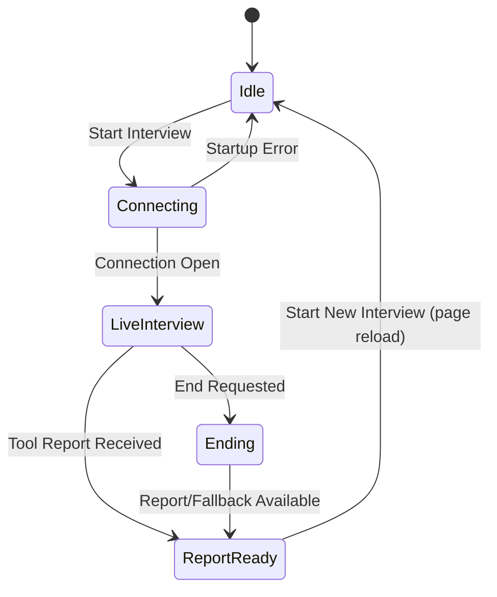
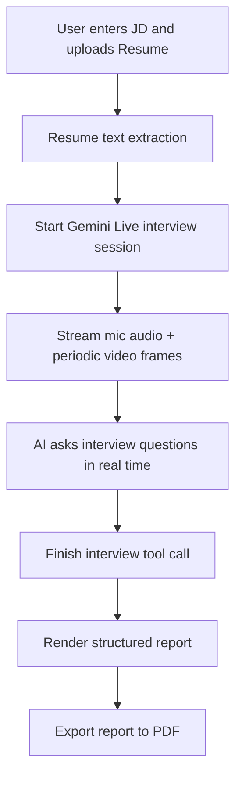

# AI Mock Interviewer

A real-time, browser-based mock interview platform powered by Gemini Live API.
It personalizes interview questions using your resume and target job description, analyzes spoken responses and visual cues, and generates a structured post-interview report.

## Documentation Index

- Detailed architecture report: [ARCHITECTURE.md](./ARCHITECTURE.md)
- Main interview UI: [src/App.tsx](./src/App.tsx)
- Live session orchestration: [src/hooks/useLiveInterview.ts](./src/hooks/useLiveInterview.ts)
- Audio pipeline utilities: [src/lib/audioUtils.ts](./src/lib/audioUtils.ts)
- Resume PDF extraction: [src/lib/pdfUtils.ts](./src/lib/pdfUtils.ts)

## Core Features

- Role-targeted interview simulation using resume + JD context
- Real-time voice interview with AI interviewer
- Periodic webcam frame analysis for body-language/emotion feedback
- Structured final report with:
   - overall feedback
   - strengths
   - areas for improvement
   - body-language analysis
   - overall score
- One-click report export to PDF

## Architecture Snapshot

The app follows a modular client-side architecture:

- Presentation Layer
   - `src/App.tsx` renders all user states:
      - Setup form (JD + resume)
      - Live interview screen
      - Final report and PDF export

- Orchestration Layer
   - `src/hooks/useLiveInterview.ts` manages:
      - Gemini Live connection lifecycle
      - Audio/video stream transport
      - AI tool-call handling
      - fallback and cleanup behavior

- Utility Layer
   - `src/lib/audioUtils.ts` for audio capture/playback encoding pipeline
   - `src/lib/pdfUtils.ts` for resume text extraction from PDFs
   - `src/lib/utils.ts` for UI class name composition helper

For full system design, flows, state model, resilience details, and extension roadmap, read [ARCHITECTURE.md](./ARCHITECTURE.md).

## Detailed Architecture

### 1. Project Overview

AI Mock Interviewer is a browser-based, real-time interview simulator built with React + TypeScript + Vite.
It combines:

- Candidate context ingestion (Job Description + Resume text/PDF)
- Live multimodal interview session (audio + periodic video frames)
- AI-driven questioning and assessment
- Final interview report generation and PDF export

The project runs fully on the client side, with the Gemini Live API handling interview intelligence and report generation.

### 2. Primary Product Goals

- Simulate a realistic technical/behavioral interview in real time.
- Personalize questions using candidate resume and target job description.
- Evaluate not only answers, but also visible confidence/body-language cues.
- Generate a structured post-interview feedback report.
- Let users export the report as a downloadable PDF.

### 3. Runtime Lifecycle

#### 3.1 Input Phase

1. User enters job description text.
2. User uploads resume file:
    - PDF -> text extraction via `pdfjs-dist`
    - TXT -> plain text read
3. UI validates both inputs before allowing interview start.

#### 3.2 Session Startup Phase

1. `startInterview(resumeText, jobDescription)` is called.
2. Hook initializes:
    - Gemini client
    - Audio recorder (mic + camera permissions)
    - Audio player for AI voice output
3. Hook connects to Gemini Live model with:
    - System instruction containing resume + job description
    - Function tool schema for final report (`finish_interview_and_report`)
    - Audio response modality + selected voice

#### 3.3 Live Interview Phase

1. Recorder captures mic audio (16k PCM) and streams chunks to Gemini.
2. Webcam stream is attached to local preview video element.
3. Every ~2 seconds, a JPEG frame is captured and sent for visual signal analysis.
4. Gemini returns streamed audio; player schedules PCM playback (24k).
5. UI shows connection state, speaking animation, and interview timer.

#### 3.4 Interview End + Report Phase

1. User ends interview or AI decides interview is complete.
2. Hook requests model to call `finish_interview_and_report`.
3. Model returns structured feedback fields:
    - overall_feedback
    - strengths[]
    - areas_for_improvement[]
    - emotion_and_body_language
    - score
4. Hook stores report and transitions UI to report view.
5. User may export report UI to PDF.

#### 3.5 Cleanup Phase

On close/error/end, hook reliably clears:

- Recording processor/source
- Active media tracks
- Audio playback queue
- Video frame interval
- End timeout fallback
- Live session handle

### 4. Component Responsibilities

- `src/main.tsx`
   - App bootstrap and root render.

- `src/App.tsx`
   - Main UI and interaction controller.
   - Handles:
      - Job description input
      - Resume upload/extraction trigger
      - Interview start/end controls
      - Live session screen rendering
      - Final report rendering + PDF export

- `src/hooks/useLiveInterview.ts`
   - Core session orchestration layer.
   - Encapsulates:
      - Gemini Live connection setup
      - Recorder/player lifecycle
      - Stream/message callbacks
      - Tool call handling for report generation
      - Error/fallback behaviors

- `src/lib/audioUtils.ts`
   - Audio transport utilities.
   - `AudioRecorder`:
      - captures mic input
      - converts Float32 -> PCM16 -> Base64
   - `AudioPlayer`:
      - decodes Base64 PCM16
      - schedules smooth AudioContext playback

- `src/lib/pdfUtils.ts`
   - PDF parsing utility.
   - Configures PDF.js worker and extracts text page by page.

- `src/lib/utils.ts`
   - Styling helper (`cn`) combining `clsx` + `tailwind-merge`.

- `src/index.css`
   - Tailwind import, typography setup, and animation styles.

### 5. State Model

The application behaves like a finite-state UI controlled by `report`, `isConnecting`, `isConnected`, and `error`.



### 6. Data and Control Flows

#### 6.1 Resume Data Flow

1. File input receives PDF/TXT.
2. Parser extracts plain text.
3. Resume text is passed into interview system instruction.

#### 6.2 Audio Flow

1. Browser mic stream -> `AudioRecorder`.
2. Recorder emits Base64 PCM16 chunks.
3. Hook forwards chunks to Gemini Live session.
4. AI audio chunks returned -> `AudioPlayer`.
5. Player schedules output to speakers.

#### 6.3 Video/Body-Language Flow

1. Webcam stream is displayed locally.
2. Snapshot frames captured on fixed interval.
3. Frames sent to Gemini as JPEG inline data.
4. Final report includes emotion/body-language summary.

### 7. AI Integration Design

#### 7.1 Prompting Strategy

The system instruction combines:

- Role definition (expert interviewer)
- Candidate context (resume + JD)
- Interview process rules (drive interview, ask follow-up questions)
- End condition rules (5-6 questions or user request)
- Mandatory tool usage for final report

#### 7.2 Tool-Based Structured Output

Instead of free-form text parsing, the app uses function calling to enforce schema and improve reliability.

Benefits:

- Predictable report payload
- Simple UI binding
- Cleaner fallback behavior when partial/missing fields exist

#### 7.3 Fallback Strategy

If report generation is delayed or fails, a fallback report is produced after timeout to preserve user flow.

### 8. Error Handling and Resilience

Current resilience mechanisms:

- Input validation before start.
- Try/catch wrappers around startup/end operations.
- Graceful tool-call argument fallback.
- Timeout-based fallback report on delayed termination.
- Defensive cleanup in both `onerror` and `onclose` callbacks.

Potential edge cases to monitor:

- Device permission denial (mic/camera).
- Browser AudioContext restrictions.
- Network instability during live stream.
- Oversized or malformed resume files.

### 9. Security and Privacy Considerations

- API key is injected via Vite environment variable (`GEMINI_API_KEY`).
- Resume and interview content are transmitted to Gemini service for processing.
- No custom backend persistence layer exists in this repository.
- Media streams are local and explicitly stopped during cleanup.

Recommended hardening:

- Move API access behind a server-side proxy for production.
- Add explicit data-retention statement in product docs.
- Add file size/type guardrails and user-facing privacy notice.

### 10. Performance Characteristics

- Lightweight client architecture with no custom backend server required.
- Snapshot interval (2 seconds) balances visual analysis fidelity and bandwidth usage.
- Audio playback queue scheduling reduces glitches between chunks.
- PDF export renders current report DOM; export time scales with report complexity.

## High-Level Flow



## Tech Stack

- Frontend: React 19 + TypeScript
- Build Tool: Vite
- Styling: Tailwind CSS v4
- AI Runtime: `@google/genai` (Gemini Live)
- PDF/Text: `pdfjs-dist`
- Report Export: `html2canvas` + `jsPDF`
- Icons: `lucide-react`

## Project Structure

```text
.
|- ARCHITECTURE.md
|- README.md
|- index.html
|- package.json
|- vite.config.ts
|- src/
|  |- App.tsx
|  |- main.tsx
|  |- index.css
|  |- hooks/
|  |  |- useLiveInterview.ts
|  |- lib/
|     |- audioUtils.ts
|     |- pdfUtils.ts
|     |- utils.ts
```

## Environment Setup

Create a `.env.local` file in the project root:

```bash
GEMINI_API_KEY=your_api_key_here
```

Notes:

- Camera and microphone permissions are required for live interview mode.
- API key is exposed to the frontend build in current architecture; use a backend proxy for production hardening.

## Run Locally

Prerequisite: Node.js 18+

1. Install dependencies:

```bash
npm install
```

2. Start development server:

```bash
npm run dev
```

3. Open the app in browser (default):

```text
http://localhost:3000
```

## Build and Validation

Build production bundle:

```bash
npm run build
```

Preview production build:

```bash
npm run preview
```

Type-check project:

```bash
npm run lint
```

## Operational Notes

- Interview end is handled via AI tool call with timeout fallback report.
- If a complete report is not returned in time, the app provides a default feedback report to avoid blocking the user.
- Media tracks and live resources are cleaned up during end/error/close transitions.

## Future Improvements

- Add backend token proxy and session APIs
- Add persistent interview history
- Add transcript and per-question scoring
- Add automated tests for hook lifecycle and error paths

## Legacy Link

Original AI Studio app link: https://ai.studio/apps/0cfba4a6-d245-4845-bfbd-3286f14c2efa
